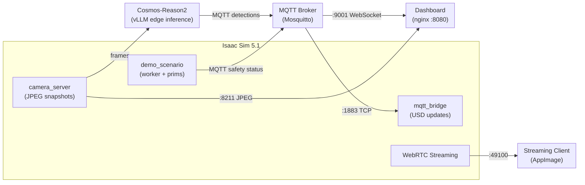
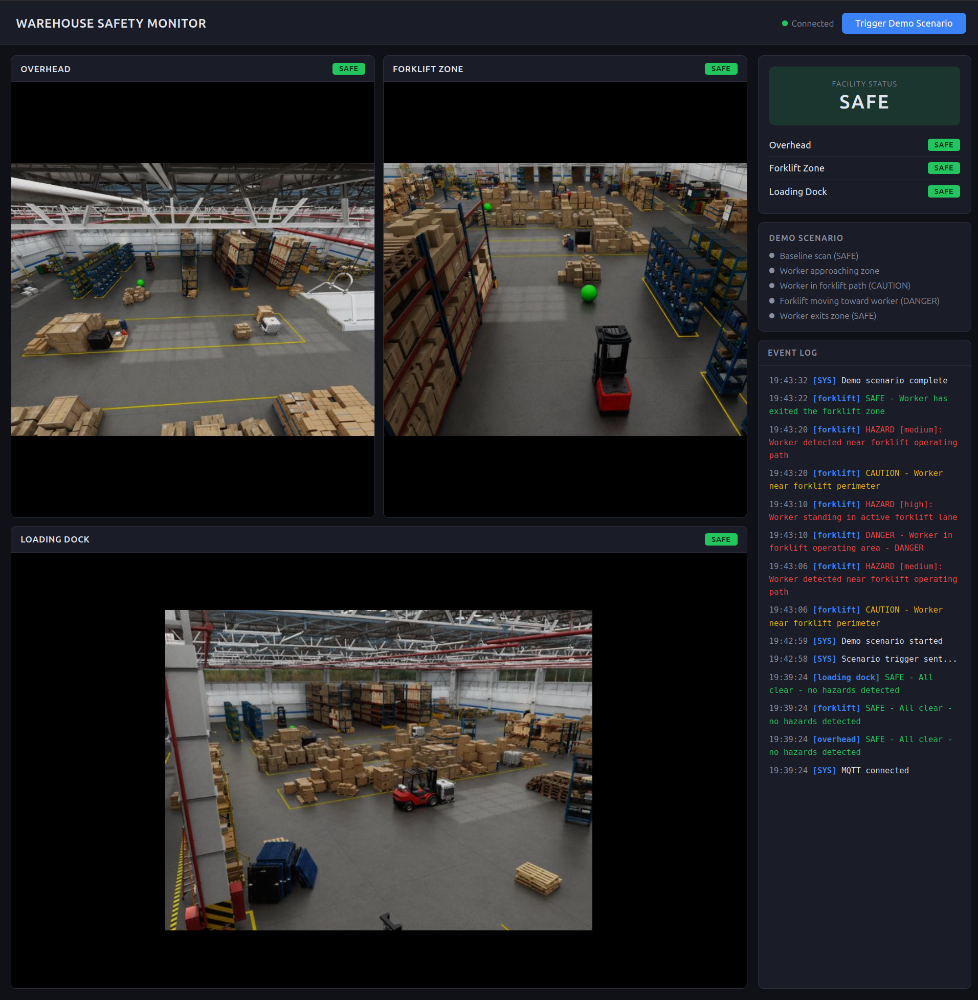
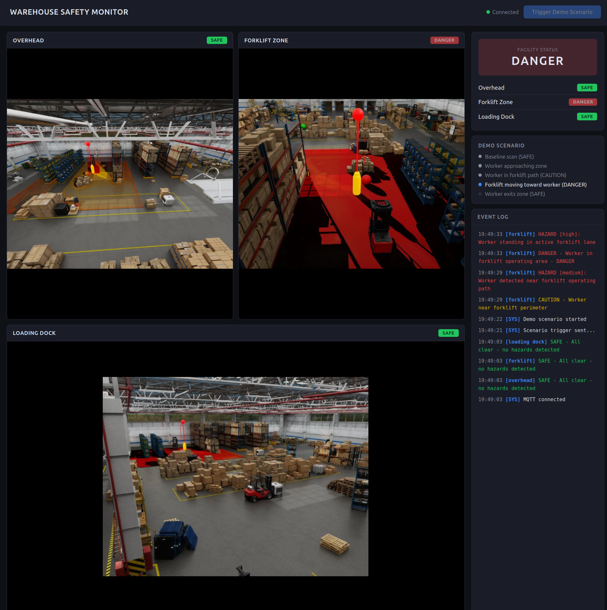

# Warehouse Safety Digital Twin

A warehouse safety monitoring system built with NVIDIA Isaac Sim and Cosmos-Reason2. Simulated security cameras feed an edge AI model that detects safety hazards (workers in forklift paths, blocked exits, fallen pallets). Detections flow over MQTT back into the digital twin, which highlights danger zones in real-time. The annotated scene streams to a viewer via WebRTC.

This is the same architectural pattern used by BMW (FactoryExplorer), PepsiCo (Digital Twin Composer), and KION/GXO (autonomous forklift fleet twins) on NVIDIA Omniverse.

## Architecture



## Components

| Component | Container/Process | Purpose |
|-----------|-------------------|---------|
| Isaac Sim 5.1 | `isaac-sim` | 3D warehouse scene, camera rendering, streaming |
| Camera Server | Isaac Sim Script Editor | In-process HTTP server serving JPEG snapshots on port 8211 |
| Demo Scenario | Isaac Sim Script Editor | Worker + forklift prim animation, MQTT safety status |
| MQTT Bridge | Isaac Sim Script Editor | Subscribes to MQTT, updates USD alert prims |
| Dashboard | `dashboard` (nginx) | Web UI showing camera feeds and safety status |
| Mosquitto | `mqtt-broker` | MQTT message broker (ports 1883 TCP, 9001 WebSocket) |
| Cosmos-Reason2-2B | `cosmos-edge` | Vision-language model for safety analysis |

## Prerequisites

- NVIDIA GPU with 32+ GB VRAM
- [Podman](https://podman.io/) with [NVIDIA Container Toolkit](https://docs.nvidia.com/datacenter/cloud-native/container-toolkit/latest/install-guide.html) (CDI mode)
- NGC API key for pulling Isaac Sim container
- ~30 GB disk for containers and assets

### One-time setup

1. **SimReady Warehouse dataset** — download from [HuggingFace](https://huggingface.co/datasets/nvidia/PhysicalAI-SimReady-Warehouse-01) into `simready-warehouse/`
2. **Cosmos-Reason2-2B model** — download the W4A16 quantized weights into `models/cosmos-reason2-2b-w4a16/`
3. **Isaac Sim streaming client** — download the [AppImage](https://download.isaacsim.omniverse.nvidia.com/isaacsim-webrtc-streaming-client-1.0.6-linux-x64.AppImage) to the project root
4. **Cache directories** — create and set permissions:
   ```bash
   mkdir -p isaac-sim/{cache/main,cache/computecache,logs,data}
   chmod -R 777 isaac-sim/
   ```

## Quick Start

```bash
# Start all containers (Isaac Sim, MQTT broker, dashboard)
./scripts/launch.sh start

# Wait for Isaac Sim to load (watch for streaming ready message)
podman logs -f isaac-sim

# Connect the streaming client to 127.0.0.1

# In Isaac Sim Script Editor, run scripts in this order:
exec(open("/workspace/create_alerts.py").read())
exec(open("/workspace/mqtt_bridge.py").read())
exec(open("/workspace/camera_server.py").read())
exec(open("/workspace/demo_scenario.py").read())

# Open dashboard at http://localhost:8080

# Trigger the demo scenario from the dashboard button, or:
mosquitto_pub -h localhost -t warehouse/control/trigger_demo -m '{"action":"start"}'

# Check status
./scripts/launch.sh status

# Stop everything
./scripts/launch.sh stop
```

## Project Structure

```
scripts/
  edge_inference.py       # Watches camera frames, sends to Cosmos, publishes MQTT
  launch.sh               # Start/stop/status for all containers

dashboard/
  index.html              # Web dashboard with camera feeds and safety status
  nginx.conf              # nginx config (serves dashboard, proxies MQTT WebSocket)

workspace/                  # Mounted into Isaac Sim container at /workspace
  camera_server.py          # In-process HTTP server serving JPEG snapshots (port 8211)
  create_alerts.py          # Creates alert spheres and zone planes
  demo_scenario.py          # Demo: worker walks into forklift zone, publishes safety status
  mqtt_bridge.py            # MQTT-to-USD bridge (runs in Script Editor)
  add_demo_forklift.py      # Standalone forklift prim creation from scene assets
  fix_cameras.py            # Restore cameras to saved positions
  print_cameras.py          # Capture current camera positions to file
  set_camera_from_view.py   # Set a camera to match current viewport
  cleanup_alerts.py         # Remove alert prims from the scene
  warehouse_safety_scene.usd  # Saved scene with warehouse + cameras

mqtt-config/
  mosquitto.conf            # MQTT broker config (anonymous dev access)
```

## How It Works

1. **Camera server** — `camera_server.py` runs inside Isaac Sim, using Replicator annotators to capture frames from three security cameras and serving them as JPEG snapshots via HTTP on port 8211

2. **Demo scenario** — `demo_scenario.py` animates a worker prim walking into a forklift zone near a parked forklift, publishing safety status changes (SAFE → CAUTION → DANGER → SAFE) to MQTT

3. **Dashboard** — Web UI at port 8080 polls camera feeds directly from port 8211 and receives safety status updates via MQTT over WebSocket. Shows live camera views with color-coded safety indicators

4. **MQTT bridge** — `mqtt_bridge.py` runs inside Isaac Sim's Script Editor, subscribes to `warehouse/safety/#`, and updates USD prims:
   - Alert spheres change color (green/yellow/red) based on `overall_status`
   - Zone planes become visible on CAUTION/DANGER, hidden on SAFE

5. **Edge inference** — `edge_inference.py` sends camera frames to Cosmos-Reason2-2B via vLLM's OpenAI-compatible API, publishing structured JSON results to MQTT

6. **Streaming** — Isaac Sim streams the annotated 3D scene via WebRTC to the AppImage client on port 49100

## VRAM Budget

Both Isaac Sim and Cosmos-Reason2 run on a single GPU:

| Component | VRAM |
|-----------|------|
| Isaac Sim (DLSS Balanced, 0.375 texture budget) | ~14 GB |
| Cosmos-Reason2-2B W4A16 (vLLM, 25% util) | ~8 GB |
| **Total** | **~22 GB** |

## Screenshots

**Streaming Client** — Isaac Sim warehouse scene with security cameras, alert zones, and Script Editor


**Dashboard (Safe)** — Live camera feeds with all zones reporting SAFE after demo completion


**Dashboard (Danger)** — Worker detected in forklift operating area, zone highlighted red

